## X-RL

A [Roguelike](https://en.wikipedia.org/wiki/Roguelike) in 1kb of JavaScript,
for [JS1k 2019](https://js1k.com/2019-x)

[Play it here](https://js1k.com/2019-x/demo/4134)

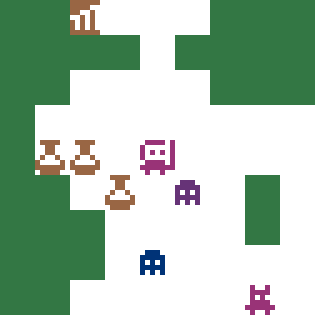

Mow down your enemies. Find the e**X**it!

Featuring:

- Hand-drawn, 1bit sprites
- Colorful!
- Two different monsters
- Healing potions
- Sword upgrades
- Five dungeon levels
- Randomly generated, a new game every time

Arrow keys to move, bump to use/attack/get

[Commented, unminified source](src/index.ts)

## Minification Strategy

- pack sprites into strings using a hand-written tool
- keep code as simple and samey as possible to ensure good packing
- add one feature at a time and only golf down when we go above 1024 bytes
- iterate, iterate, iterate! At every iteration:
  - use [uglify](https://skalman.github.io/UglifyJS-online/) for minification
    - examine the minified code to find things that didn't minify as well as they
      could have
  - use [regpack](http://siorki.github.io/regPack.html) for packing
    - look at what tokens nearly had a compression gain and try to reuse them
      elsewhere
- use GitHub, check in often
- use [TypeScript](http://typescriptlang.org/) to help catch typos and errors in ugly, complicated code

### Tricky/weird stuff to save bytes:

- Bit level packing and unpacking sprites to and from strings, using a size
  that ensures each sprite row fits into the printable ASCII range 32-127
  so that 1 row never exceeds 1 byte
- Adding properties to arrays so that they can be both iterated over and also
  directly queried for data
- Inlining to a ludicrous degree at the expense of readability

## Sprite Encoder Tool

Takes a sprite sheet saved as PNG, and spits out a packed string

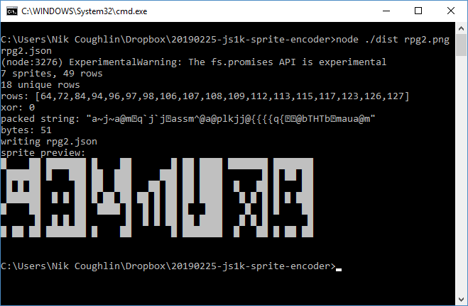

If you're interested in the code, let me know and I'll tidy it up and release
it on GitHub

## A Visual Development History

NB, this only shows some interesting milestones, there are a lot more
[commits](https://github.com/nrkn/js1k-2019/commits/master) involving all kinds
of golfing, experimenting, abandoned features, bug fixes etc.

### [47c5903123f6a9207bfab96ab21c4a62ab7ca7e9](https://github.com/nrkn/js1k-2019/tree/47c5903123f6a9207bfab96ab21c4a62ab7ca7e9)

This was my first proper commit. It was just to test that I could draw the
sprites - the colours were picked pretty much at random, which is why it looks
so weird. The map just picks a sprite at random for each tile.

At this stage I was planning to make a 1k version of my JS13k game,
[Ranger Down](https://js13kgames.com/entries/ranger-down), so the sprites were
adapted from those.

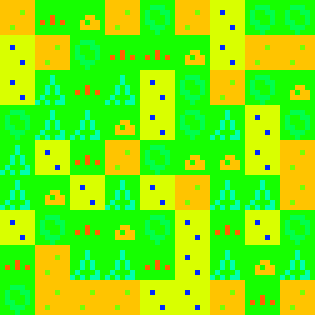

### [b8c0284f6a8e91c3b82c8453e08fdb05d6a80b31](https://github.com/nrkn/js1k-2019/tree/b8c0284f6a8e91c3b82c8453e08fdb05d6a80b31)

OK - after crunching some numbers I realised that Ranger Down was too ambitious.
There was no way I was going to get something even resembling it done in 1k.
I decided to fall back to a Roguelike, I've done plenty of those before. I
generated some rectangular rooms and used a graph to connect them together with
corridors:

Here's a dungeon generated by the graph-based algorithm - not bad!

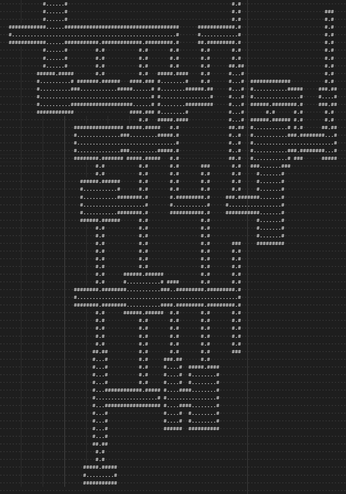

### [dd846797e6a0fdb52d0a9729556499e840983ec8](https://github.com/nrkn/js1k-2019/tree/dd846797e6a0fdb52d0a9729556499e840983ec8)

Then I added some monsters - a ghost seemed like a good monster to use, it's
easy to fit into the tiny sprites, plus it has that PAC-MAN nostalgia:

### [4020b16e396cd7be629499710f49b87182082cbc](https://github.com/nrkn/js1k-2019/tree/4020b16e396cd7be629499710f49b87182082cbc)

At this stage, I was already pretty much out of bytes, with no gameplay

The pretty, clever dungeons had to go. I implemented a much simpler generator
that created acceptable, but much crappier dungeons. Instead of using a graph,
it just randomly draws rectangles one at a time, then a corridor in a random
direction, then another rectangle at the end of the corridor etc until the
desired number of rooms are created. This means rooms and corridors often
overlap, which gives it a more organic but less Roguelike feel.

Another thing that had to go was the concept of having the walls just around
the edges of the rooms and corridors, which looks much nicer but was pretty
byte-hungry.

Here's an example of the dungeons generated by the crappy algorithm:

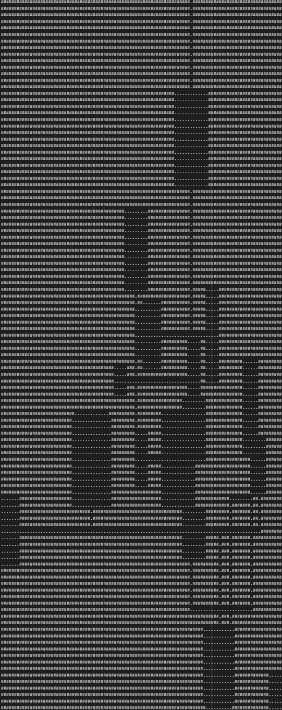

### [ebb60c27ba496baeba8d4fb2c9de4536f92ea7d5](https://github.com/nrkn/js1k-2019/tree/ebb60c27ba496baeba8d4fb2c9de4536f92ea7d5)

You can now walk around and fight monsters - both the player and the monsters'
color move closer to red as their health decreases. Some of the rooms were
larger than the viewport, so I added some random floor tiles because otherwise
if you were in a very large room you couldn't tell that you were moving and it
felt weird

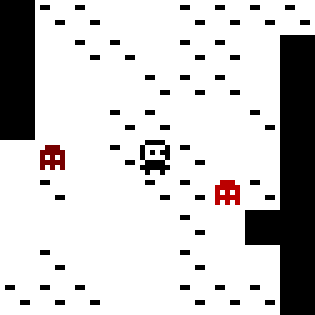

### [6bbe12d05fa2cd4854891267fdd6b3d94006d2fb](https://github.com/nrkn/js1k-2019/tree/6bbe12d05fa2cd4854891267fdd6b3d94006d2fb)

I needed to add some more gameplay elements, like healing potions, but those
dungeons with rectangular rooms and corridors were just too greedy.

I ended up resorting to an old favourite technique, just randomly tunnelling
out a cave-like area

This version has potions, and most of the sprites were redrawn - the main change
was that I removed the pixels from the right hand side of the player sprite's
face - at this stage I was already hoping to be able to give them a sword, and
with the limited sprite size it would have looked bad drawn right up against
the player sprite's face

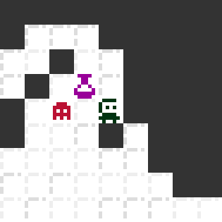

### [350736edee24bb62e4cb522478296c38871eca75](https://github.com/nrkn/js1k-2019/tree/350736edee24bb62e4cb522478296c38871eca75)

OK, so you can fight monsters and pick up healing potions, but once you'd
cleared the level, what more is there to do? It was time to add stairs to the
next level.

The level generator was modified so that bigger caves would be generated on each
subsequent level, and the monster density would rise. The walls are different
colours on different levels, and I simplified the floor sprites to save a few
bytes.

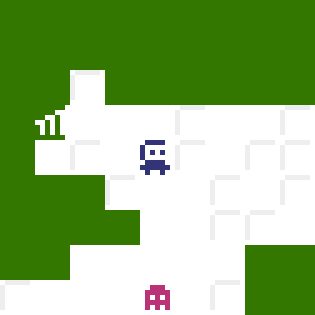

### [ddc17cd8b705c285185320d87bd5d2e7f5c7e7fe](https://github.com/nrkn/js1k-2019/tree/ddc17cd8b705c285185320d87bd5d2e7f5c7e7fe)

In a simple game, there should be some way to win.

When you get far enough down the dungeon, there's a statue you can get
(I chose to make the goal a statue so I could reuse the player sprite) that
allows you to win.

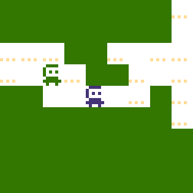

I had to iterate this quite a bit to make a "win screen" that didn't take too
many bytes and came up with this:

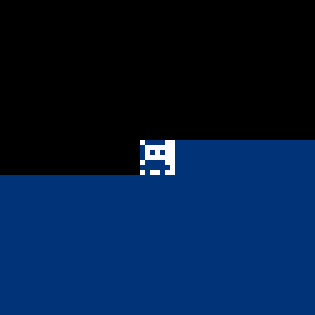

Some text or something saying "you win!" would have been nice, but way too many
bytes!

What I ended up doing for the win screen was sending the player to a new level,
just like if they went down the stairs, but having the map generator not
generate anything for the "win" level - I expected it to just show the player in
the center of the screen, but a by-product of the way the draw loop works means
that the first half of the viewport is coloured differently to the last half,
because after the player gets drawn, the fillstyle is set to the player color,
which is actually quite a nice glitch.

The floor sprite was again simplified - it reuses a row from the ghost sprite,
so that the 7 bytes from that row can be compressed by the packer.

### [819b253b0c1eeff93ffefa8becbe9bf68579e035](https://github.com/nrkn/js1k-2019/tree/819b253b0c1eeff93ffefa8becbe9bf68579e035)

The final thing I wanted was for the player to be able to have a weapon, and
for the monsters to sometimes drop sword upgrades so that there is a reason
to fight them, rather than just trying to avoid them and get to the bottom
level.

The sword starts small, like a knife, and gets bigger (and more effective
against the monsters) as you pick up more sword upgrades. It's drawn dynamically
because it would have been expensive having five different sprites for the sword
and adding code to overlay that over the player sprite, or to have five player
sprite variants.

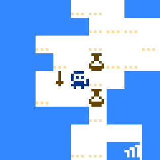

This addition really blew the byte count out - I didn't make a note, but it was
at least 1200 bytes now. However, it made the game so much better that I really
wanted to keep it.

To get it under, I basically:

- removed the floor sprite entirely - it wasn't just the 7 bytes for the sprite,
  but also the logic in the map generator to make two different floor types,
  and all the collision logic had to know that both floor types were walkable.
  Additionally, the new cave generator rarely creates large open areas, so the
  reason for decorating the floors wasn't needed anymore, which was to help you
  stay oriented when moving around areas with no visible walls. A shame though,
  as it did add to the overall aesthetic.
- changed it so that swords and potions just shared the same "item" sprite
  and you didn't know what it was until you picked it up - yuck - this was
  disgusting but I was struggling to get the bytes down
- removed all the colours except walls and player/monster health - this removed
  a lot of visual interest but saved a lot of bytes

I was *not* happy with this version, so I golfed as hard as I could in order to:

- have separate potion/sword sprites again
- add some colour back in

I golfed so well, that in the end I was able to also add:

- have the exit have its own sprite instead of a statue that looked like the
  player, I wanted to a) have a nod to this year's theme and b) have something
  distinct that wouldn't confuse people
- monsters drop a potion instead of a sword if your sword is already at max, it
  was bothering me getting sword upgrades that I didn't need
- an extra monster sprite! this actually only ended up being a handful of bytes
  and if I had more room I would add another one or two.

I often wish there was something between JS1k and JS13k, like JS2k or JS4k,
because by the time I've finished a 1k there are often lots of small things I'd
like to add.

What I would add if I had some more bytes (most of these aren't feasible in 1k):

- monsters drop coins and there is occasionally a shop where you can spend them
  to buy better weapons
- armour - the monsters would be more powerful so that it was actually needed
- a ranged weapon, like a bow
- wall and floor sprites rather than solid blocks
- add proper dungeon generator back in
- more monsters
- monsters have different behaviour
- more use of color
- maybe doors?
- treasure chests?
- more levels - hindered by the use throughout the codebase of the string with
  five different hex values for colors

## License

MIT License

Copyright (c) 2019 Nik Coughlin

Permission is hereby granted, free of charge, to any person obtaining a copy
of this software and associated documentation files (the "Software"), to deal
in the Software without restriction, including without limitation the rights
to use, copy, modify, merge, publish, distribute, sublicense, and/or sell
copies of the Software, and to permit persons to whom the Software is
furnished to do so, subject to the following conditions:

The above copyright notice and this permission notice shall be included in all
copies or substantial portions of the Software.

THE SOFTWARE IS PROVIDED "AS IS", WITHOUT WARRANTY OF ANY KIND, EXPRESS OR
IMPLIED, INCLUDING BUT NOT LIMITED TO THE WARRANTIES OF MERCHANTABILITY,
FITNESS FOR A PARTICULAR PURPOSE AND NONINFRINGEMENT. IN NO EVENT SHALL THE
AUTHORS OR COPYRIGHT HOLDERS BE LIABLE FOR ANY CLAIM, DAMAGES OR OTHER
LIABILITY, WHETHER IN AN ACTION OF CONTRACT, TORT OR OTHERWISE, ARISING FROM,
OUT OF OR IN CONNECTION WITH THE SOFTWARE OR THE USE OR OTHER DEALINGS IN THE
SOFTWARE.